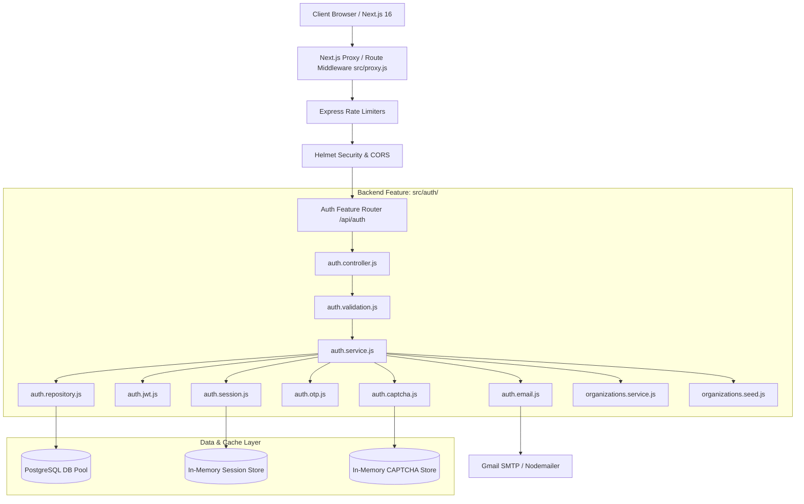
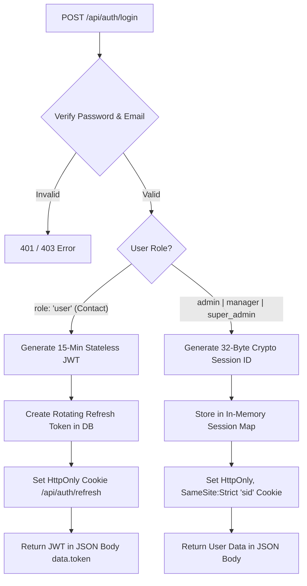
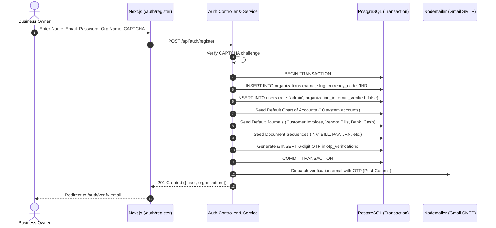
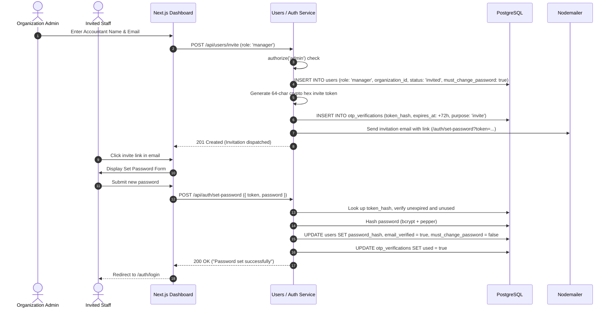
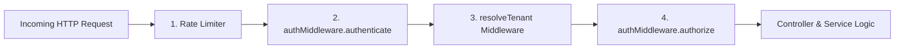
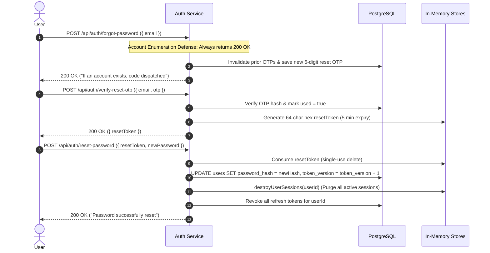
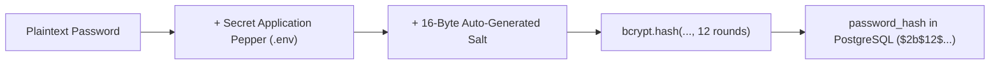

# Urban Furniture Authentication & Authorization Architecture

A secure, multi-tenant authentication and authorization architecture for the **Urban Furniture** ERP platform, built with **Node.js (Express 5), PostgreSQL (`pg.Pool`), bcrypt, JWT, and in-memory privileged sessions**, integrated with **Next.js 16 App Router (React 19)**.

---

## Table of Contents
1. [Architecture Overview & System Flowchart](#1-architecture-overview--system-flowchart)
2. [Project Roles & Actor Mapping](#2-project-roles--actor-mapping)
3. [Dual-Strategy Authentication Design](#3-dual-strategy-authentication-design)
4. [Comprehensive User Flows](#4-comprehensive-user-flows)
   - [4.1 Organization Self-Registration (Business Owner / Admin)](#41-organization-self-registration-business-owner--admin)
   - [4.2 Staff Invitation & Onboarding (Accountant / Manager)](#42-staff-invitation--onboarding-accountant--manager)
   - [4.3 Contact Portal Provisioning (Customer / Vendor)](#43-contact-portal-provisioning-customer--vendor)
   - [4.4 Dual-Strategy Login & Session Issuance](#44-dual-strategy-login--session-issuance)
   - [4.5 Transparent Token Refresh with Single-Flight Lock](#45-transparent-token-refresh-with-single-flight-lock)
   - [4.6 Multi-Tenant Request Execution & RBAC Pipeline](#46-multi-tenant-request-execution--rbac-pipeline)
   - [4.7 Password Reset & Dual-Tier Revocation](#47-password-reset--dual-tier-revocation)
   - [4.8 Logout & Browser Cache (bfcache) Defense](#48-logout--browser-cache-bfcache-defense)
5. [Frontend Architecture & State Integration](#5-frontend-architecture--state-integration)
   - [5.1 Centralized API Client (`src/lib/api.js`)](#51-centralized-api-client-srclibapijs)
   - [5.2 Global Authentication Context (`src/context/AuthContext.jsx`)](#52-global-authentication-context-srccontextauthcontextjsx)
   - [5.3 Edge Route Protection & Middleware (`src/proxy.js`)](#53-edge-route-protection--middleware-srcproxyjs)
6. [Password & Credential Security Model](#6-password--credential-security-model)
7. [Email Verification, OTP & CAPTCHA Lifecycle](#7-email-verification-otp--captcha-lifecycle)
8. [Multi-Tenant Database Schema & Migrations](#8-multi-tenant-database-schema--migrations)
9. [Complete API Endpoint Catalog](#9-complete-api-endpoint-catalog)
10. [Security Hardening & Threat Mitigation Matrix](#10-security-hardening--threat-mitigation-matrix)
11. [Environment Configuration Reference](#11-environment-configuration-reference)

---

## 1. Architecture Overview & System Flowchart

Urban Furniture operates as a **Feature-Based Modular Monolith**. All authentication, session, verification, and credential logic resides within `Backend/src/auth/` and communicates seamlessly with the Next.js 16 frontend.



---

## 2. Project Roles & Actor Mapping

Per the **Technical Requirements (§3.2)**, the project defines four distinct actors mapped directly to the existing database schema without modifying the underlying database `CHECK` constraint:

| Business Actor (`project.md`) | Database Role (`users.role`) | Authentication Strategy | Credential Storage | Primary Responsibility & Scope |
|---|---|---|---|---|
| **Admin (Business Owner)** | `admin` | Stateful Server Session (`sid` cookie) | `HttpOnly`, `SameSite: Strict` Cookie | Self-signs up, owns organization, manages staff, fiscal periods, master data modifications, and cancellations. |
| **Invoicing User (Accountant)** | `manager` | Stateful Server Session (`sid` cookie) | `HttpOnly`, `SameSite: Strict` Cookie | Internal finance staff. Records invoices, vendor bills, payments, journal entries, and views financial reports. |
| **Contact (Customer / Vendor)** | `user` | Stateless JWT Bearer + Refresh Cookie | In-Memory (React variable); Refresh cookie in `HttpOnly` | External portal access. Customers view unpaid invoices and pay online; Vendors review historical bill statements. |
| **Platform Operator** | `super_admin` | Stateful Server Session (`sid` cookie) | `HttpOnly`, `SameSite: Strict` Cookie | Global system operator for maintenance and diagnostics across organizations. Not an accounting actor. |

### Architectural Rationale: "Map, Do Not Rename"
- **Constraint Stability**: Retains PostgreSQL `CHECK (role IN ('user', 'manager', 'admin', 'super_admin'))` without database schema thrashing.
- **Zero Regression**: Preserves backend guards (`authMiddleware.authenticate`, `authSession.isPrivilegedRole`, `authJwt`).
- **Internal Mapping vs. User Display**: The internal identifier `manager` is translated to `"Accountant"` / `"लेखाकार"` / `"હિસાબનીશ"` via `next-intl` (`dashboard.roles.manager`). Users never see internal enum values.
- **Principle of Least Privilege**: External contacts receive strictly scoped JWTs without access to internal accounting endpoints.

---

## 3. Dual-Strategy Authentication Design

To reconcile high-security requirements for privileged internal staff with lightweight, stateless sessions for high-volume portal contacts, the system runs a **Dual-Strategy Authentication Model**:



### Identity Strategy Matrix

| Dimension | Standard Contact (`user`) | Privileged Staff (`manager`, `admin`, `super_admin`) |
|---|---|---|
| **Mechanism** | Stateless JWT (Bearer Authorization Header) | Stateful Server-Side Session (`sid` Cookie) |
| **Token Lifespan** | 15 minutes (short-lived) | 30 minutes (sliding inactivity window) |
| **Persistence** | In-memory only in frontend client (`_token`) | Browser cookie jar (managed automatically by browser) |
| **Refresh Mechanism** | Rotating refresh token via `POST /api/auth/refresh` | Sliding session expiry on each active request |
| **Revocation Defense** | Database `token_version` bump (instant invalidation) | In-memory `sessionStore.delete(sessionId)` |
| **Reuse Detection** | Revokes entire family if revoked refresh token used | Inherent session deletion on logout or reset |

---

## 4. Comprehensive User Flows

### 4.1 Organization Self-Registration (Business Owner / Admin)

**Rule**: Only Business Owners may publicly self-register. Registration atomically sets up the Organization and default accounting configuration.



> [!IMPORTANT]
> **Post-Commit Mail Guarantee**: The verification email is dispatched *after* the PostgreSQL transaction commits. A transient SMTP failure will log an error but will **never** roll back a successfully created organization and user ledger.

---

### 4.2 Staff Invitation & Onboarding (Accountant / Manager)

**Rule**: Accountants cannot self-register. They are invited by an authenticated `admin`.



---

### 4.3 Contact Portal Provisioning (Customer / Vendor)

**Rule**: Contacts (Customers and Vendors) receive portal access when provisioned by an Admin or Accountant from the Contact Master.

1. Staff toggles **"Enable Portal Access"** on the contact record (`POST /api/contacts/:id/portal-access`).
2. Backend creates a corresponding record in `users`:
   - `role = 'user'`
   - `contact_id = contact.id`
   - `organization_id = contact.organization_id`
   - `email_verified = false`, `must_change_password = true`
3. Generates a 72-hour single-use activation token in `otp_verifications` (`purpose = 'portal_invite'`).
4. Contact receives activation email, sets their password via `/auth/set-password`, and logs in.
5. On login, [`getDashboardPath('user')`](file:///c:/Users/neels/OneDrive/Desktop/Urban_Furniture/Frontend/src/context/AuthContext.jsx#L232-L244) directs them directly to `/[locale]/portal` (Customer or Vendor portal views).

---

### 4.4 Dual-Strategy Login & Session Issuance

```mermaid
sequenceDiagram
    autonumber
    actor Client as User / Staff / Contact
    participant Web as Next.js Frontend
    participant API as Auth Controller & Service
    participant DB as PostgreSQL

    Client->>Web: Enter Email, Password, optional CAPTCHA
    Web->>API: POST /api/auth/login
    API->>DB: SELECT * FROM users WHERE email = $1
    API->>API: bcrypt.compare(password + PEPPER, user.password_hash)
    API->>API: Assert user.email_verified === true

    alt Role is 'admin' or 'manager' (Privileged Staff)
        API->>API: Generate 32-byte crypto sessionId
        API->>API: Store in memory sessionStore.set(sessionId, { userId, role, orgId })
        API-->>Web: Set-Cookie: sid=...; HttpOnly; SameSite=Strict; Path=/
        API-->>Web: 200 OK (data: { user, authType: 'session' })
    else Role is 'user' (Contact)
        API->>API: Generate 15m JWT with payload { sub: id, role: 'user', tokenVersion }
        API->>DB: INSERT INTO refresh_tokens (token_hash, user_id, expires_at: +30d)
        API-->>Web: Set-Cookie: refreshToken=...; HttpOnly; SameSite=Lax; Path=/api/auth
        API-->>Web: 200 OK (data: { user, token: jwtString, authType: 'jwt' })
    end
```

---

### 4.5 Transparent Token Refresh with Single-Flight Lock

To ensure a seamless user experience for Contacts without race conditions or token reuse penalties:

```mermaid
sequenceDiagram
    autonumber
    actor User as Contact User
    participant Page as React UI Components
    participant APIClient as src/lib/api.js
    participant Server as Backend /api/auth/refresh

    Page->>APIClient: api.get('/portal/invoices')
    APIClient->>Server: GET /api/portal/invoices (Authorization: Bearer <expired-jwt>)
    Server-->>APIClient: 401 Unauthorized

    Note over APIClient: Intercept 401: Acquire _refreshPromise Lock
    APIClient->>Server: POST /api/auth/refresh (Cookie: refreshToken=...)
    Server->>Server: SHA-256 hash incoming cookie & verify in DB
    Server->>Server: Rotate: Mark old token revoked, generate new refresh token
    Server-->>APIClient: Set-Cookie: refreshToken=<new-token>; 200 OK { token: <new-jwt> }
    
    APIClient->>APIClient: setToken(newJWT), Release _refreshPromise
    APIClient->>Server: RETRY: GET /api/portal/invoices (Authorization: Bearer <new-jwt>)
    Server-->>APIClient: 200 OK (Invoices Data)
    APIClient-->>Page: Return data seamlessly
```

> [!TIP]
> **Single-Flight Lock**: If three parallel component queries fail with `401` at the exact same millisecond, [`_refreshPromise`](file:///c:/Users/neels/OneDrive/Desktop/Urban_Furniture/Frontend/src/lib/api.js#L21) queues requests behind a single in-flight call to `/auth/refresh`. This prevents backend **Token Reuse Detection** from mistakenly revoking valid credentials.

---

### 4.6 Multi-Tenant Request Execution & RBAC Pipeline

Every incoming domain request undergoes a rigorous 4-stage pipeline:



1. **`authenticate`**:
   - Detects either `sid` cookie or `Authorization: Bearer <token>`.
   - Validates session existence or decodes JWT.
   - Re-queries PostgreSQL for fresh user record on every call (never trusts client claims).
   - Validates `user.token_version === payload.tokenVersion`.
   - Asserts `email_verified === true`.
2. **`resolveTenant`**:
   - Extracts `req.user.organization_id`.
   - Injects `organization_id` into repository queries (`WHERE organization_id = $1`).
   - Prevents cross-tenant data leaks.
3. **`authorize(...roles)`**:
   - Asserts that `req.user.role` is included in permitted roles (e.g. `authorize('admin', 'manager')`).
   - Responds with `403 Forbidden` on role mismatch.
4. **`authorizeOwnerOrRoles(getOwnerIdFn, ...privilegedRoles)` / Contact Scope**:
   - For contact portal endpoints, `contact_id` is always derived strictly from `req.user.contact_id`. An ID supplied in route parameters is never trusted for ownership.

---

### 4.7 Password Reset & Dual-Tier Revocation



---

### 4.8 Logout & Browser Cache (bfcache) Defense

1. Client triggers `logout()` in [`AuthContext.jsx`](file:///c:/Users/neels/OneDrive/Desktop/Urban_Furniture/Frontend/src/context/AuthContext.jsx#L177-L191).
2. Frontend calls `POST /api/auth/logout`:
   - Server invalidates server-side session from in-memory store.
   - Clears `sid` and `refreshToken` cookies via `Set-Cookie: ... Max-Age=0`.
3. Frontend executes:
   - `clearToken()` to erase the in-memory JWT.
   - `setUser(null)`.
   - `window.location.replace('/auth/login')` (replaces history entry).
4. **Bfcache Protection**: A window event listener on `pageshow` inspects `event.persisted`. If a user clicks the browser's "Back" button after logout, `window.location.reload()` is forced, preventing exposure of cached dashboard snapshots.

---

## 5. Frontend Architecture & State Integration

### 5.1 Centralized API Client (`src/lib/api.js`)
- **Base URL**: Prepends `NEXT_PUBLIC_API_URL` (default: `http://localhost:5000/api`).
- **In-Memory JWT**: Managed via [`setToken()`](file:///c:/Users/neels/OneDrive/Desktop/Urban_Furniture/Frontend/src/lib/api.js#L23), [`getToken()`](file:///c:/Users/neels/OneDrive/Desktop/Urban_Furniture/Frontend/src/lib/api.js#L27), and [`clearToken()`](file:///c:/Users/neels/OneDrive/Desktop/Urban_Furniture/Frontend/src/lib/api.js#L31). Never exposed to web storage.
- **Cookies**: Always sends `credentials: 'include'`.
- **Interception**: Traps `401 Unauthorized` responses and triggers [`performTokenRefresh()`](file:///c:/Users/neels/OneDrive/Desktop/Urban_Furniture/Frontend/src/lib/api.js#L39-L67).
- **Single-Flight Lock**: Deduplicates concurrent refresh requests using `_refreshPromise`.

### 5.2 Global Authentication Context (`src/context/AuthContext.jsx`)
- **Authoritative Hydration**: Hydrates state on app load by attempting `POST /auth/refresh` followed by `GET /auth/me`.
- **Strict Mode Deduplication**: Uses module-level `_initAuthPromise` to prevent React 18 Strict Mode double-mount from triggering backend token rotation reuse detection.
- **Exposed Properties & Methods**:
  - `user`: Authenticated user object (`{ id, name, email, role, organization_id }`).
  - `role`: Current user role string (`admin`, `manager`, `user`, `super_admin`).
  - `isAuthenticated`: Boolean derived from presence of `user`.
  - `loading`: Boolean indicating active initial credential check.
  - `login(credentials)`: Submits login and updates user state.
  - `logout()`: Destroys server credentials and redirects.
  - `refreshUser()`: Forces re-fetch of `/auth/me`.
- **Role Redirection**:
  ```js
  export function getDashboardPath(role) {
    switch (role) {
      case 'admin':       return '/dashboard/admin';
      case 'manager':     return '/dashboard/manager';
      case 'super_admin': return '/dashboard/super-admin';
      case 'user':
      default:            return '/portal';
    }
  }
  ```

### 5.3 Edge Route Protection & Middleware (`src/proxy.js`)
- Runs at the Next.js edge HTTP layer.
- Performs locale negotiation (`/en`, `/hi`, `/gu`).
- Bounces unauthenticated traffic away from protected surfaces (`/dashboard/*`, `/portal/*`).
- Bounces authenticated traffic away from auth pages (`/auth/login`, `/auth/register`).

---

## 6. Password & Credential Security Model

Passwords undergo **Defense-in-Depth Hashing**:



- **Salt**: 16 bytes generated per user by `bcrypt` (12 rounds).
- **Pepper**: Application-level secret loaded strictly from process environment variables (`PASSWORD_PEPPER`). **The pepper is never stored in the database.**
- **Breach Impact**: Even in the event of a full PostgreSQL dump, stored hashes cannot be cracked with precomputed rainbow tables or offline GPU clusters without the environment pepper.
- **Complexity Requirements**: 8–128 characters, at least one uppercase letter, one lowercase letter, one number, and one special character.

---

## 7. Email Verification, OTP & CAPTCHA Lifecycle

### 7.1 Verification OTP Lifecycle
- **Generator**: `crypto.randomInt(100000, 1000000)` produces a 6-digit numeric OTP.
- **Storage**: Stored as an HMAC-SHA256 hash using `OTP_SECRET`. Plaintext OTP is never persisted.
- **Lifespan**: Configurable via `OTP_EXPIRES_MINUTES` (default: 10 minutes).
- **Attempt Limiting**: Maximum 5 failed attempts per OTP record. Exceeding limit permanently invalidates the OTP.
- **Comparison**: Evaluated using constant-time `crypto.timingSafeEqual` to eliminate timing side-channel vulnerabilities.

### 7.2 Server-Side CAPTCHA Engine
- **Generation**: Arithmetic challenges generated on demand (`GET /api/auth/captcha`).
- **Storage**: Correct answer stored as HMAC-SHA256 in an in-memory map keyed by a 32-byte crypto ID.
- **Lifespan**: 5 minutes, single-use, max 3 verification attempts.
- **Zero Leakage**: Answers are never transmitted to the client; only the challenge text and ID are sent.

---

## 8. Multi-Tenant Database Schema & Migrations

### Migration Ledger & Tables

#### 1. `organizations` (Migration `006_create_organizations.js`)
Root multi-tenant entity.
```sql
CREATE TABLE IF NOT EXISTS organizations (
    id                      UUID PRIMARY KEY DEFAULT gen_random_uuid(),
    name                    VARCHAR(150) NOT NULL,
    slug                    VARCHAR(150) UNIQUE NOT NULL,
    currency_code           CHAR(3) NOT NULL DEFAULT 'INR',
    fiscal_year_start_month SMALLINT NOT NULL DEFAULT 4,
    status                  VARCHAR(10) NOT NULL DEFAULT 'active' CHECK (status IN ('active', 'archived')),
    created_by              UUID REFERENCES users(id),
    updated_by              UUID REFERENCES users(id),
    created_at              TIMESTAMPTZ NOT NULL DEFAULT NOW(),
    updated_at              TIMESTAMPTZ NOT NULL DEFAULT NOW()
);
CREATE INDEX IF NOT EXISTS idx_organizations_slug ON organizations(slug);
```

#### 2. `users` (Migrations `001`, `004`, `007`)
Core user accounts scoped to organizations or contacts.
```sql
CREATE TABLE IF NOT EXISTS users (
    id                   UUID PRIMARY KEY DEFAULT gen_random_uuid(),
    name                 VARCHAR(255) NOT NULL,
    email                VARCHAR(255) NOT NULL UNIQUE,
    password_hash        VARCHAR(255) NOT NULL,
    role                 VARCHAR(50) NOT NULL DEFAULT 'user' 
                         CHECK (role IN ('user', 'manager', 'admin', 'super_admin')),
    email_verified       BOOLEAN NOT NULL DEFAULT false,
    token_version        INTEGER NOT NULL DEFAULT 1,
    organization_id      UUID NULL REFERENCES organizations(id),
    contact_id           UUID NULL,
    must_change_password BOOLEAN NOT NULL DEFAULT false,
    created_at           TIMESTAMPTZ NOT NULL DEFAULT NOW(),
    updated_at           TIMESTAMPTZ NOT NULL DEFAULT NOW()
);
CREATE INDEX IF NOT EXISTS idx_users_organization_id ON users(organization_id);
```

#### 3. `otp_verifications` (Migration `002_create_otp_verifications_table.js`)
Stores hashed tokens for email verification, password reset, and invites.
```sql
CREATE TABLE IF NOT EXISTS otp_verifications (
    id         UUID PRIMARY KEY DEFAULT gen_random_uuid(),
    user_id    UUID NOT NULL REFERENCES users(id) ON DELETE CASCADE,
    purpose    VARCHAR(50) NOT NULL CHECK (purpose IN ('email_verification', 'password_reset', 'invite', 'portal_invite')),
    otp_hash   VARCHAR(255) NOT NULL,
    expires_at TIMESTAMPTZ NOT NULL,
    attempts   INTEGER NOT NULL DEFAULT 0,
    used       BOOLEAN NOT NULL DEFAULT false,
    created_at TIMESTAMPTZ NOT NULL DEFAULT NOW()
);
```

#### 4. `refresh_tokens` (Migration `005_create_refresh_tokens_table.js`)
Persists rotating refresh tokens with reuse detection.
```sql
CREATE TABLE IF NOT EXISTS refresh_tokens (
    id          UUID PRIMARY KEY DEFAULT gen_random_uuid(),
    user_id     UUID NOT NULL REFERENCES users(id) ON DELETE CASCADE,
    token_hash  VARCHAR(255) NOT NULL UNIQUE,
    expires_at  TIMESTAMPTZ NOT NULL,
    revoked_at  TIMESTAMPTZ NULL,
    replaced_by VARCHAR(255) NULL,
    user_agent  TEXT NULL,
    ip_address  VARCHAR(45) NULL,
    created_at  TIMESTAMPTZ NOT NULL DEFAULT NOW()
);
CREATE INDEX IF NOT EXISTS idx_refresh_tokens_lookup ON refresh_tokens(token_hash, revoked_at, expires_at);
```

---

## 9. Complete API Endpoint Catalog

### Public Endpoints
| Method | Endpoint | Description | Rate Limit |
|---|---|---|---|
| `GET` | `/api/health` | Service health & database connectivity check | Standard |
| `GET` | `/api/auth/captcha` | Generates arithmetic challenge and ID | Captcha limiter (30/15m) |
| `POST` | `/api/auth/register` | Business owner signup + organization creation | Auth limiter (10/15m) |
| `POST` | `/api/auth/verify-email` | Verifies account via 6-digit OTP | OTP limiter (30/15m) |
| `POST` | `/api/auth/resend-verification-otp` | Re-issues email verification code | OTP limiter (30/15m) |
| `POST` | `/api/auth/login` | Authenticates user (dual-strategy issuance) | Auth limiter (10/15m) |
| `POST` | `/api/auth/refresh` | Rotates refresh token & returns new JWT | Auth limiter (10/15m) |
| `POST` | `/api/auth/forgot-password` | Initiates password reset flow | OTP limiter (30/15m) |
| `POST` | `/api/auth/verify-reset-otp` | Confirms reset OTP, returns `resetToken` | OTP limiter (30/15m) |
| `POST` | `/api/auth/reset-password` | Sets new password via `resetToken` | Auth limiter (10/15m) |
| `POST` | `/api/auth/set-password` | Sets password via single-use invitation token | Auth limiter (10/15m) |

### Protected Core Endpoints
| Method | Endpoint | Description | Access Guard |
|---|---|---|---|
| `POST` | `/api/auth/logout` | Revokes server session & clears cookies | Authenticated (Any) |
| `GET` | `/api/auth/me` | Returns current server-verified user profile | `authenticate` |
| `GET` | `/api/auth/users/:id` | Returns user details with ownership verification | `authorizeOwnerOrRoles('admin', 'super_admin')` |

### Multi-Tenant & Administrative Endpoints
| Method | Endpoint | Description | Access Guard |
|---|---|---|---|
| `POST` | `/api/users/invite` | Invites Accountant staff (`role: 'manager'`) | `authenticate`, `resolveTenant`, `authorize('admin')` |
| `POST` | `/api/contacts/:id/portal-access` | Provisions portal login for customer/vendor | `authenticate`, `resolveTenant`, `authorize('admin', 'manager')` |
| `GET` | `/api/auth/manager/dashboard` | Accountant/Manager metrics | `authorize('manager', 'admin', 'super_admin')` |
| `GET` | `/api/auth/admin/users` | Lists users within the organization | `authorize('admin', 'super_admin')` |
| `PATCH` | `/api/auth/admin/users/:id/role` | Updates user role (Platform maintenance) | `authorize('super_admin')` |

---

## 10. Security Hardening & Threat Mitigation Matrix

| Vulnerability / Threat | Mitigation Mechanism | Verification / Code Location |
|---|---|---|
| **SQL Injection (SQLi)** | 100% Parameterized queries using `pg.Pool` (`$1, $2, ...`) | `auth.repository.js` |
| **Password Offline Cracking** | `bcrypt` (12 rounds) + Secret application `PASSWORD_PEPPER` | `auth.service.js`, `env.js` |
| **Cross-Site Scripting (XSS)** | `HttpOnly` cookies for sessions and refresh tokens; JWT in-memory only | `api.js`, `auth.session.js` |
| **Cross-Site Request Forgery (CSRF)** | `SameSite=Strict` on session cookies; custom headers on API calls | `auth.session.js`, `api.js` |
| **Insecure Direct Object Reference (IDOR)** | Scoped queries by `organization_id` & `contact_id`; `authorizeOwnerOrRoles` | `auth.middleware.js`, `portal/` |
| **Account Enumeration** | Identical generic responses for forgot-password and resend-OTP | `auth.service.js` |
| **Session Fixation** | Generates brand-new 32-byte cryptographic session ID on login | `auth.session.js` |
| **Token Replay / Reuse** | Single-use OTPs/reset tokens; Token reuse detection family revocation | `auth.service.js`, `refresh_tokens` |
| **Brute Force Attacks** | IP-based rate limiting via `express-rate-limit` (Auth, OTP, CAPTCHA) | `auth.routes.js` |
| **Timing Side-Channel Attacks** | Constant-time string and buffer comparison via `crypto.timingSafeEqual` | `crypto.js`, `auth.otp.js` |
| **Information Leakage** | Sensitive keys redacted in logger; zero stack traces leaked in 500 errors | `logger.js`, `error.middleware.js` |

---

## 11. Environment Configuration Reference

Create or update `.env` in `Backend/` with the following variables:

```ini
# Server Environment
PORT=5000
NODE_ENV=development

# Database (PostgreSQL)
DB_HOST=localhost
DB_PORT=5432
DB_NAME=ODOO_INDIA
DB_USER=postgres
DB_PASSWORD=Hello
DB_POOL_MAX=20
DB_IDLE_TIMEOUT_MS=30000
DB_CONNECTION_TIMEOUT_MS=2000

# Security — Passwords & Pepper
BCRYPT_ROUNDS=12
PASSWORD_PEPPER=super-secret-pepper-change-in-production-must-be-long-and-random-32chars

# Security — JWT (Contacts / Users)
JWT_SECRET=super-secret-jwt-key-change-in-production-must-be-at-least-32-chars-long
JWT_EXPIRES_IN=15m
REFRESH_TOKEN_EXPIRES_DAYS=30

# Security — Server Sessions (Privileged Staff)
SESSION_SECRET=super-secret-session-key-change-in-production-must-be-at-least-32-chars
SESSION_MAX_AGE_MS=1800000

# Email (Gmail SMTP / Nodemailer)
SMTP_HOST=smtp.gmail.com
SMTP_PORT=587
SMTP_USER=your-email@gmail.com
SMTP_PASS=your-gmail-app-password

# CORS Configuration
CORS_ORIGIN=http://localhost:3000

# Rate Limiting
RATE_LIMIT_WINDOW_MS=900000
RATE_LIMIT_MAX=100
AUTH_RATE_LIMIT_WINDOW_MS=900000
AUTH_RATE_LIMIT_MAX=10

# Expiration & Attempt Thresholds
OTP_EXPIRES_MINUTES=10
OTP_MAX_ATTEMPTS=5
CAPTCHA_EXPIRES_MINUTES=5
```
