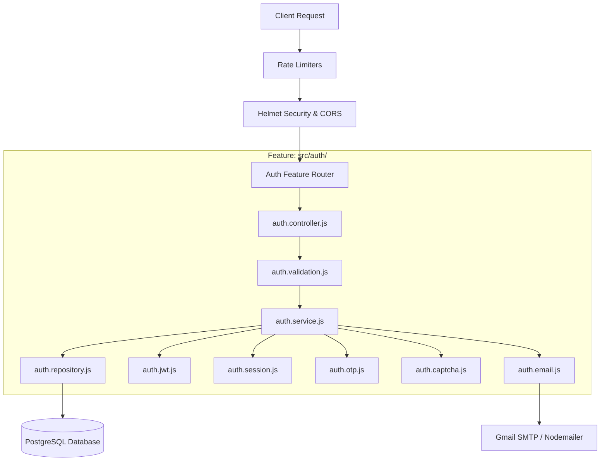
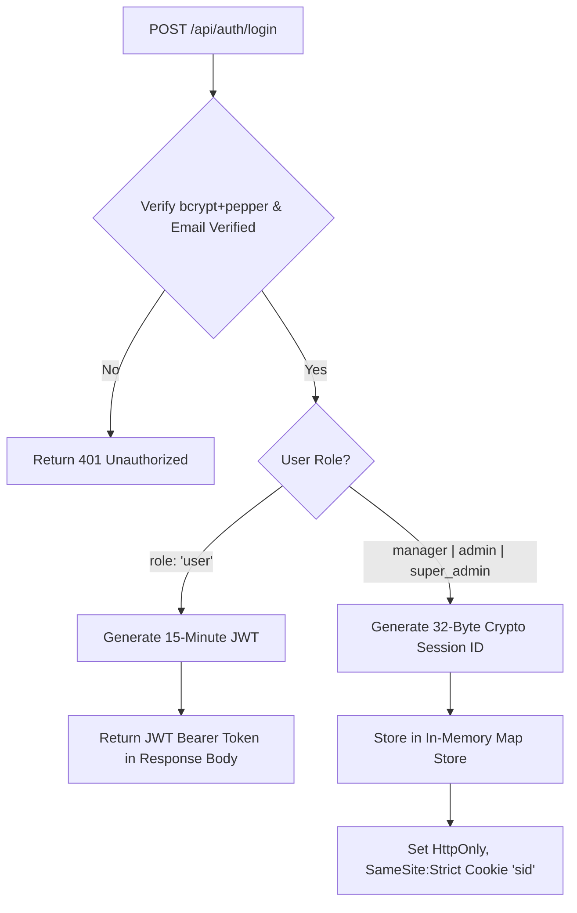
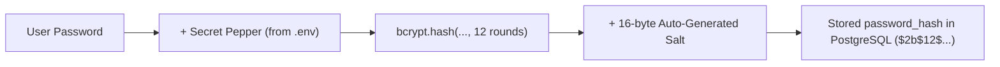
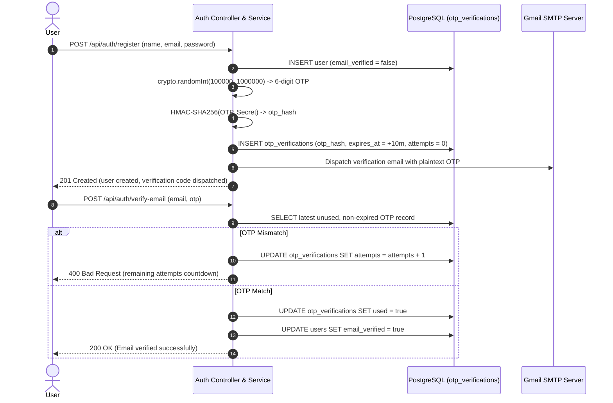
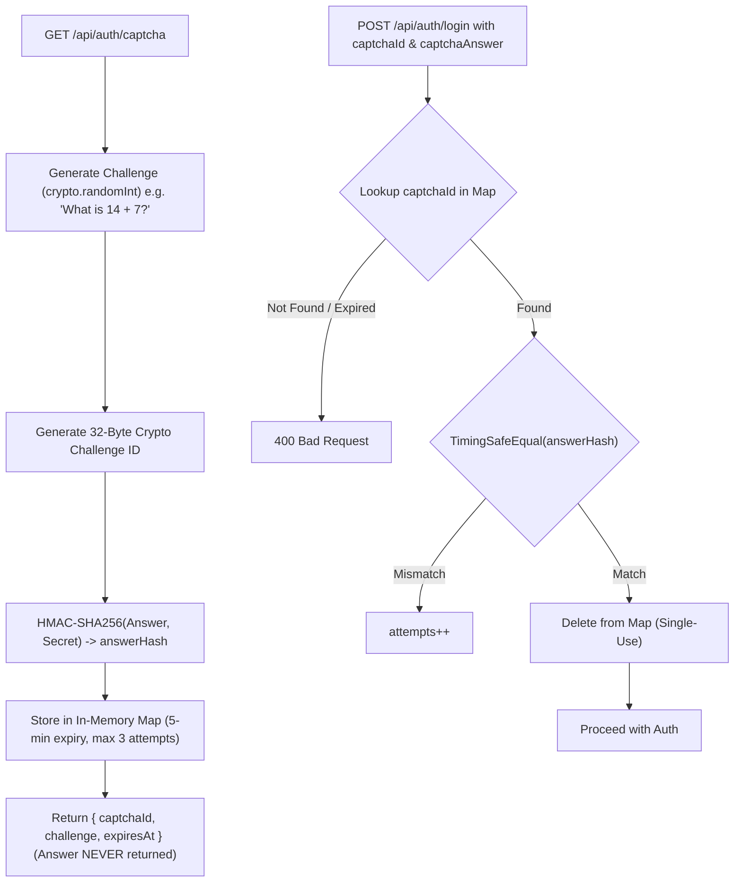
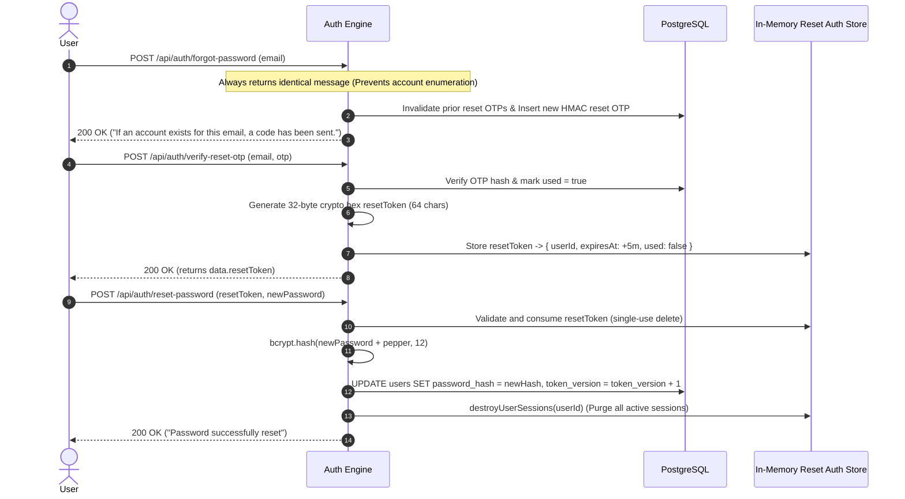
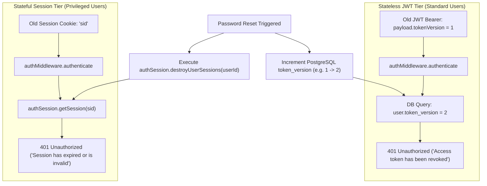

# Modular Monolith Authentication & Authorization Architecture

A secure, feature-based backend authentication and authorization engine built with **Node.js, Express, PostgreSQL, bcrypt, JWT, and in-memory privileged sessions**.

---

## Table of Contents
1. [Architecture Overview & System Flowchart](#1-architecture-overview--system-flowchart)
2. [Feature-Based Folder Structure](#2-feature-based-folder-structure)
3. [Dual-Strategy Authentication Design](#3-dual-strategy-authentication-design)
4. [Password Security Model (bcrypt + Salt + Pepper)](#4-password-security-model-bcrypt--salt--pepper)
5. [Email Verification & OTP Lifecycle](#5-email-verification--otp-lifecycle)
6. [Server-Side CAPTCHA System](#6-server-side-captcha-system)
7. [Password Reset & Transactional Authorization](#7-password-reset--transactional-authorization)
8. [Dual-Tier Revocation Engine](#8-dual-tier-revocation-engine)
9. [Role-Based Access Control (RBAC) & Resource Ownership (IDOR)](#9-role-based-access-control-rbac--resource-ownership-idor)
10. [Database Schema & Migrations](#10-database-schema--migrations)
11. [Security Hardening & Threat Mitigation](#11-security-hardening--threat-mitigation)
12. [Environment Configuration Reference](#12-environment-configuration-reference)
13. [Complete API Endpoint Catalog](#13-complete-api-endpoint-catalog)
14. [Automated Security Audit & Testing Guide](#14-automated-security-audit--testing-guide)
15. [Hackathon vs. Production Considerations](#15-hackathon-vs-production-considerations)

---

## 1. Architecture Overview & System Flowchart

The application employs a **Feature-Based Modular Monolith** architecture. All authentication and authorization logic resides strictly within the self-contained `src/auth/` feature module.



---

## 2. Feature-Based Folder Structure

```text
Backend/
├── src/
│   ├── app.js                          # Express application initialization (Helmet, CORS, CookieParser)
│   ├── server.js                       # HTTP server entry point & graceful shutdown
│   ├── config/
│   │   ├── env.js                      # Centralized environment variable validation & typing
│   │   ├── db.js                       # PostgreSQL pg.Pool connection pool
│   │   └── mail.js                     # Nodemailer transporter instance
│   ├── middleware/
│   │   ├── error.middleware.js         # Centralized sanitized error handler (zero stack traces leaked)
│   │   └── notFound.middleware.js      # Catch-all 404 handler
│   ├── utils/
│   │   ├── logger.js                   # Structured logger with sensitive-data redaction
│   │   ├── response.js                 # Standardized JSend-style API response utilities
│   │   └── crypto.js                   # Crypto random helpers & constant-time comparator
│   ├── database/
│   │   └── migrations/
│   │       ├── 001_create_users_table.js
│   │       ├── 002_create_otp_verifications_table.js
│   │       ├── 003_drop_duplicate_email_index.js
│   │       ├── 004_add_token_version_to_users.js
│   │       └── run-migrations.js       # Idempotent migration runner
│   └── auth/                           # SELF-CONTAINED AUTH FEATURE MODULE
│       ├── auth.routes.js              # Auth endpoints + rate limiting
│       ├── auth.controller.js          # HTTP request/response handlers
│       ├── auth.service.js             # Core authentication & authorization business logic
│       ├── auth.repository.js          # Parameterized PostgreSQL queries for users & OTPs
│       ├── auth.validation.js          # Strict payload validation & password complexity checks
│       ├── auth.middleware.js          # authenticate, authorize, and authorizeOwnerOrRoles
│       ├── auth.jwt.js                 # 15m JWT generator & verifier with tokenVersion claim
│       ├── auth.session.js             # In-memory Map() session store with 32-byte crypto IDs
│       ├── auth.otp.js                 # 6-digit randomInt, HMAC-SHA256 hasher & timer
│       ├── auth.captcha.js             # Arithmetic challenge generator & HMAC answer store
│       └── auth.email.js               # HTML & text email dispatch via Gmail SMTP
├── tests/
│   └── security-audit.test.js          # 47-point end-to-end security audit suite
├── .env.example
├── package.json
├── README.md
└── auth.md
```

---

## 3. Dual-Strategy Authentication Design

To balance performance with maximum security for administrative capabilities, the system implements a **Dual-Strategy Authentication Model**:



### Identity Strategy Matrix

| Dimension | Standard Users (`user`) | Privileged Users (`manager`, `admin`, `super_admin`) |
|---|---|---|
| **Mechanism** | Stateless JWT (Bearer Authorization Header) | Stateful Server-Side Session (`sid` Cookie) |
| **Lifespan** | 15 minutes | 30 minutes (sliding/inactivity) |
| **Payload/Storage** | `{ sub: userId, role: 'user', tokenVersion }` | In-Memory `Map()` Store (`userId`, `role`, `expiresAt`) |
| **Cookie Security** | N/A | `httpOnly: true`, `sameSite: 'strict'`, `secure: production` |
| **Fixation Defense** | N/A | Generates brand new 32-byte crypto random ID on login |
| **Revocation** | Bump `token_version` in PostgreSQL | In-memory `sessionStore.delete(sessionId)` |

---

## 4. Password Security Model (bcrypt + Salt + Pepper)

Passwords are protected using a **Defense-in-Depth Hashing Strategy**:



- **Salt**: 16 bytes, uniquely generated per user by `bcrypt` (12 rounds / $2^{12}$ iterations).
- **Pepper**: Application-level secret string loaded strictly from process environment variables (`.env`). **The pepper is NEVER stored in the database.**
- **Breach Impact**: Even in the event of a full PostgreSQL dump, stored hashes cannot be cracked with precomputed rainbow tables or offline GPU clusters without the environment pepper.

---

## 5. Email Verification & OTP Lifecycle



- **Brute-Force Defense**: Max 5 attempts per OTP.
- **Single-Use**: OTP record immediately flagged `used = true` upon successful verification.
- **Resend Invalidation**: Requesting a new OTP flags all prior unused OTPs for that purpose as `used = true`.
- **Timing Attacks**: Constant-time `crypto.timingSafeEqual` comparison.

---

## 6. Server-Side CAPTCHA System



---

## 7. Password Reset & Transactional Authorization

To eliminate vulnerability windows between OTP verification and password updating, password reset uses a **Two-Step Transactional Authorization Token**:



---

## 8. Dual-Tier Revocation Engine

When a password is reset, or a user is demoted/promoted, all previously issued credentials must be immediately invalidated across both authentication tiers:



---

## 9. Role-Based Access Control (RBAC) & Resource Ownership (IDOR)

### Access Matrix

| Endpoint | Permitted Roles | Ownership Constraint |
|---|---|---|
| `GET /api/auth/me` | All authenticated | Own profile |
| `GET /api/auth/users/:id` | `user`, `manager`, `admin`, `super_admin` | **Strict IDOR Check**: Standard user can ONLY access own ID. `admin`/`super_admin` bypass. |
| `GET /api/auth/manager/dashboard` | `manager`, `admin`, `super_admin` | Operational role required |
| `GET /api/auth/admin/users` | `admin`, `super_admin` | Administrative role required |
| `PATCH /api/auth/admin/users/:id/role` | `super_admin` only | SuperAdmin role required |

### HTTP Status Code Discipline
- **401 Unauthorized**: User is unauthenticated, access token expired/revoked, or session destroyed.
- **403 Forbidden**: User is authenticated, but their server-verified role or resource ownership is insufficient.

---

## 10. Database Schema & Migrations

All primary keys use UUID v4 (`gen_random_uuid()`).

```sql
-- Migration 001: Users Table
CREATE TABLE IF NOT EXISTS users (
    id UUID PRIMARY KEY DEFAULT gen_random_uuid(),
    name VARCHAR(255) NOT NULL,
    email VARCHAR(255) NOT NULL UNIQUE,
    password_hash VARCHAR(255) NOT NULL,
    role VARCHAR(50) NOT NULL DEFAULT 'user' CHECK (role IN ('user', 'manager', 'admin', 'super_admin')),
    email_verified BOOLEAN NOT NULL DEFAULT false,
    created_at TIMESTAMP WITH TIME ZONE DEFAULT NOW(),
    updated_at TIMESTAMP WITH TIME ZONE DEFAULT NOW()
);

-- Migration 002: OTP Verifications Table
CREATE TABLE IF NOT EXISTS otp_verifications (
    id UUID PRIMARY KEY DEFAULT gen_random_uuid(),
    user_id UUID NOT NULL REFERENCES users(id) ON DELETE CASCADE,
    purpose VARCHAR(50) NOT NULL CHECK (purpose IN ('email_verification', 'password_reset')),
    otp_hash VARCHAR(255) NOT NULL,
    expires_at TIMESTAMP WITH TIME ZONE NOT NULL,
    attempts INTEGER NOT NULL DEFAULT 0,
    used BOOLEAN NOT NULL DEFAULT false,
    created_at TIMESTAMP WITH TIME ZONE DEFAULT NOW()
);

-- Migration 003: Drop Redundant Email Index (Handled by UNIQUE constraint)
DROP INDEX IF EXISTS idx_users_email;

-- Migration 004: Add Token Version for Instant Stateless JWT Revocation
ALTER TABLE users ADD COLUMN IF NOT EXISTS token_version INTEGER NOT NULL DEFAULT 1;
```

---

## 11. Security Hardening & Threat Mitigation

| Vulnerability / Threat | Mitigation Mechanism | Verification |
|---|---|---|
| **SQL Injection** | 100% Parameterized queries using `pg.Pool` (`$1, $2, ...`) | Neutralizes `' OR 1=1; DROP TABLE` payloads |
| **Password Offline Cracking** | bcrypt (12 rounds) + application pepper loaded from `.env` | Hashes uncrackable without pepper |
| **Account Enumeration** | `POST /forgot-password` unconditionally returns generic response | Tested identical output for missing vs existent accounts |
| **Session Fixation** | Server issues brand-new 32-byte crypto session ID on login | Old pre-login session is discarded |
| **Replay Attacks** | Single-use flag on OTPs, resetTokens, and CAPTCHAs | Tested replay rejection with 400 Bad Request |
| **IDOR / Horizontal Privilege** | `authMiddleware.authorizeOwnerOrRoles` verifies `req.user.id === params.id` | Tested User A blocked from User B resources |
| **Role Escalation** | Registration discards client `role`; role updates restricted to `super_admin` | Tested client `role: 'super_admin'` ignored |
| **Information Leakage** | Sensitive keys redacted in logger; stack traces silenced in 500 error handler | Passwords/hashes/OTPs never present in output |
| **Cross-Site Scripting (XSS)** | Secure HttpOnly cookies for sessions; Helmet security headers enabled | `X-Frame-Options`, `X-Content-Type-Options` active |

---

## 12. Environment Configuration Reference

Create a `.env` file in `Backend/` with the following variables:

```ini
# Server
PORT=5000
NODE_ENV=development

# Database (PostgreSQL)
DB_HOST=localhost
DB_PORT=5432
DB_NAME=ODOO_INDIA
DB_USER=postgres
DB_PASSWORD=Hello
DB_POOL_MAX=20
DB_IDLE_TIMEOUT_MS=30000
DB_CONNECTION_TIMEOUT_MS=2000

# Security — Passwords & Pepper
BCRYPT_ROUNDS=12
PASSWORD_PEPPER=super-secret-pepper-change-in-production-must-be-long-and-random-32chars

# Security — JWT (Standard Users)
JWT_SECRET=super-secret-jwt-key-change-in-production-must-be-at-least-32-chars-long
JWT_EXPIRES_IN=15m

# Security — Server Sessions (Privileged Roles)
SESSION_SECRET=super-secret-session-key-change-in-production-must-be-at-least-32-chars
SESSION_MAX_AGE_MS=1800000

# Email (Gmail SMTP)
SMTP_HOST=smtp.gmail.com
SMTP_PORT=587
SMTP_USER=your-email@gmail.com
SMTP_PASS=your-gmail-app-password

# CORS
CORS_ORIGIN=http://localhost:3000

# Rate Limiting
RATE_LIMIT_WINDOW_MS=900000
RATE_LIMIT_MAX=100
AUTH_RATE_LIMIT_WINDOW_MS=900000
AUTH_RATE_LIMIT_MAX=100

# OTP & CAPTCHA Expiration
OTP_EXPIRES_MINUTES=10
OTP_MAX_ATTEMPTS=5
CAPTCHA_EXPIRES_MINUTES=5
```

---

## 13. Complete API Endpoint Catalog

### Public Endpoints
- `GET  /api/health` — Service health check & database heartbeat.
- `GET  /api/auth/captcha` — Returns arithmetic challenge and `captchaId`.
- `POST /api/auth/register` — Register user (`name`, `email`, `password`, optional `captchaId`/`captchaAnswer`).
- `POST /api/auth/verify-email` — Verify email (`email`, `otp`).
- `POST /api/auth/resend-verification-otp` — Resend verification OTP (`email`).
- `POST /api/auth/login` — Authenticate (`email`, `password`, optional `captchaId`/`captchaAnswer`).
- `POST /api/auth/forgot-password` — Request reset OTP (`email`).
- `POST /api/auth/verify-reset-otp` — Verify reset OTP (`email`, `otp`), returns `resetToken`.
- `POST /api/auth/reset-password` — Set new password (`resetToken`, `newPassword`).

### Protected Authenticated Endpoints
- `POST /api/auth/logout` — Revokes session & clears cookie.
- `GET  /api/auth/me` — Returns authenticated user profile.
- `GET  /api/auth/users/:id` — Returns user profile (Owner OR `admin`/`super_admin`).

### Role-Protected Endpoints (RBAC)
- `GET   /api/auth/manager/dashboard` — Manager, Admin, SuperAdmin.
- `GET   /api/auth/admin/users` — Admin, SuperAdmin.
- `PATCH /api/auth/admin/users/:id/role` — SuperAdmin only (`{ "role": "manager" | "admin" | ... }`).

---

## 14. Automated Security Audit & Testing Guide

The repository contains a comprehensive **47-point automated test suite** in `tests/security-audit.test.js` verifying all security controls across Phases 1 through 7.

### Running Migrations
```bash
npm run migrate
```

### Starting the Development Server
```bash
npm run dev
```

### Running the Full Security Test Suite
```bash
npm test
```

### Output Preview:
```text
========================================================================
🔒 FULL SYSTEM SECURITY AUDIT & AUTOMATED TEST SUITE (PHASES 1 - 7)
========================================================================

[SECTION 1: Server Configuration & Security Headers]
  ✅ PASSED: Health endpoint responds with 200 OK
  ✅ PASSED: Helmet headers present (x-dns-prefetch-control)
  ✅ PASSED: Security headers active (clickjacking & MIME-sniffing protection)

[SECTION 2: SQL Injection Defense & Parameterization]
  ✅ PASSED: SQL injection attempt in email rejected safely (400/401)
  ✅ PASSED: No PostgreSQL error or stack trace leaked in response
  ✅ PASSED: Users table remained safe (SQL injection neutralized by parameterization)

[SECTION 3: Password Security (bcrypt + application pepper)]
  ✅ PASSED: Password hash uses bcrypt format ($2b$) with 12 salt rounds
  ✅ PASSED: Pepper is not stored in plaintext or anywhere inside PostgreSQL
  ✅ PASSED: Password verifies successfully WITH pepper
  ✅ PASSED: Password verification strictly FAILS without pepper

[SECTION 4: Registration, Role Escalation & Duplicate Defense]
  ✅ PASSED: Registration returns 201 Created
  ✅ PASSED: Client-supplied role: super_admin ignored; role forced to user
  ✅ PASSED: New user account created with email_verified: false
  ✅ PASSED: Password hash is NEVER leaked in registration response
  ✅ PASSED: Duplicate email registration returns 409 Conflict

[SECTION 5: Email Verification, OTP Hashing & Replay Defense]
  ✅ PASSED: Verification OTP record created in PostgreSQL
  ✅ PASSED: OTP is stored as a 64-character HMAC-SHA256 hex string (never plaintext)
  ✅ PASSED: Wrong OTP rejected with 400 Bad Request
  ✅ PASSED: Failed OTP attempt counter incremented in database
  ✅ PASSED: Valid OTP verifies email successfully (200 OK)
  ✅ PASSED: Database email_verified updated to true
  ✅ PASSED: Re-submitting single-use OTP rejected (Replay defense verified)

[SECTION 6: Login, JWT & Privileged Server Sessions]
  ✅ PASSED: Verified user logs in successfully
  ✅ PASSED: Standard user receives signed JWT token
  ✅ PASSED: JWT payload contains sub, role: user, and tokenVersion
  ✅ PASSED: Admin logs in successfully
  ✅ PASSED: Admin does NOT receive a JWT token (Privileged session strategy)
  ✅ PASSED: Admin receives secure HttpOnly sid session cookie

[SECTION 7: Session Fixation Prevention]
  ✅ PASSED: Re-login generates fresh 32-byte session ID (Session fixation defeated)

[SECTION 8: CAPTCHA Lifecycle, Replay & Zero-Leakage]
  ✅ PASSED: GET /captcha returns 200 OK
  ✅ PASSED: CAPTCHA challenge and ID provided
  ✅ PASSED: CAPTCHA correct answer is NEVER exposed in API response
  ✅ PASSED: Valid CAPTCHA solution verifies via constant-time HMAC
  ✅ PASSED: CAPTCHA is single-use and cannot be replayed

[SECTION 9: Password Reset, Transactional Authorization & Account Enumeration Defense]
  ✅ PASSED: Forgot password response is identical for existent & non-existent emails (Account enumeration prevented)
  ✅ PASSED: Reset OTP verified successfully
  ✅ PASSED: Separate 64-character single-use reset authorization token issued
  ✅ PASSED: Password reset succeeded with resetToken
  ✅ PASSED: Replayed resetToken is rejected (Single-use reset authorization)

[SECTION 10: Stateless JWT Revocation via token_version]
  ✅ PASSED: Database token_version incremented from 1 to 2
  ✅ PASSED: Pre-reset JWT is immediately REVOKED on GET /me due to tokenVersion mismatch

[SECTION 11: Privileged Session Revocation]
  ✅ PASSED: Admin session cookie immediately REVOKED from in-memory store upon password reset

[SECTION 12: Role-Based Access Control & Resource Ownership]
  ✅ PASSED: Unauthenticated request to /admin/users returns 401 Unauthorized
  ✅ PASSED: Standard user accessing /admin/users returns 403 Forbidden (RBAC enforced)
  ✅ PASSED: SuperAdmin successfully updates user role to manager on /admin/users/:id/role
  ✅ PASSED: User accessing own profile returns 200 OK
  ✅ PASSED: User attempting to access another user resource blocked with 403 Forbidden (IDOR Defense Verified)

========================================================================
🏆 SECURITY AUDIT COMPLETE: 47/47 TESTS PASSED WITH ZERO VULNERABILITIES
========================================================================
```

---

## 15. Hackathon vs. Production Considerations

| Architecture Area | Current Implementation (Hackathon / Monolith) | Production Scaling Roadmap |
|---|---|---|
| **Session Store** | Fast In-Memory `Map()` with automatic interval eviction | Redis cluster (`ioredis` / `connect-redis`) for multi-instance horizontal scaling |
| **CAPTCHA Store** | Fast In-Memory `Map()` with HMAC verification | Distributed Redis or Cloudflare Turnstile / hCaptcha |
| **Email Queue** | Direct Nodemailer dispatch over Gmail SMTP | Background worker queue (BullMQ + Redis) with Amazon SES / SendGrid |
| **Token Invalidation** | PostgreSQL `token_version` column check on JWT auth | Retained (PostgreSQL) or cached in Redis with short TTL |
| **Rate Limiting** | In-memory `express-rate-limit` | Redis-backed rate limiting (`rate-limit-redis`) across multiple container replicas |
